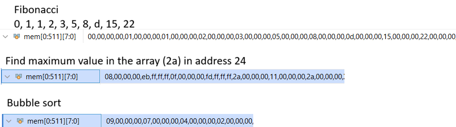

# RV32I Single-Cycle Processor

   

This project implements a single-cycle RISC-V (RV32I) processor on an Artix-7 xc7a35tcpg236 FPGA. It is a minimal yet fully functional design intended for learning, experimentation, and architectural exploration.

The processor executes each instruction in a single clock cycle and supports the base RV32I ISA.

---

## Overview

Executes the complete RV32I base integer ISA on a Basys 3 board (Artix-7 xc7a35tcpg236). All 40 instructions across all 6 encoding formats are supported — R, I, S, B, U, and J.

It's been tested running Fibonacci, bubble sort, and max-value search end-to-end on hardware.

---

## Architecture

Eight modules wired together into a single combinational datapath. The PC updates on every rising clock edge and the next instruction is already in flight.

| Module | Description |
|---|---|
| `fetch` | Drives the PC onto the instruction memory bus |
| `instruction_memory` | 128-entry ROM, loaded from a `.mem` hex file |
| `decode` | Slices the 32-bit instruction word in the appropriate fields |
| `control` | Drives control signals given the inputs |
| `register_file` | 32 × 32-bit registers, x0 hardwired to zero |
| `branch_control` | Evaluates branch conditions, asserts `branch_taken` |
| `alu` | All 10 RV32I arithmetic and logic operations |
| `data_memory` | Byte-addressable LUTRAM, supports sign- and zero-extended loads |

All types, enums, and control structs live in `risc_pkg.sv` and are imported everywhere.

---

## Numbers

| Metric | Value |
|---|---|
| Fmax | **99.79 MHz** |
| LUTs | 18,878 / 28000 (91%) |
| Flip-flops | 4,384 / 41600 (11%) |

---

## Demo programs

Three programs are included and have been verified on hardware.

| Program | 
|---|
| Fibonacci | 
| Max search | 
| Bubble sort | 

---

## What's next

- 5-stage pipeline with hazard detection and forwarding
- Branch prediction
- Instruction and data caches
- RV32IM and RV32F/D
- OS Implementation
