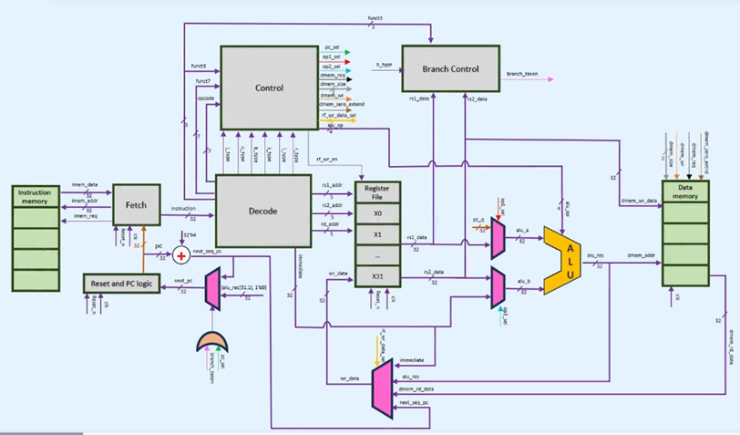
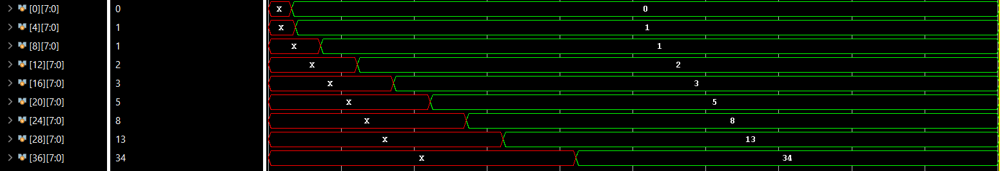
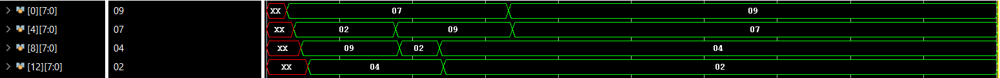
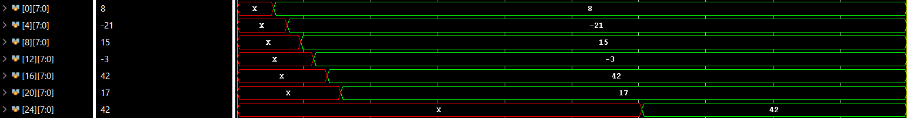

# RV32I Single-Cycle Processor

   

This project implements a single-cycle RISC-V (RV32I) processor on an Artix-7 xc7a35tcpg236 FPGA. It is a minimal yet fully functional design intended for learning, experimentation, and architectural exploration.

The processor executes each instruction in a single clock cycle and supports the base RV32I ISA.

---

## Overview

Executes the complete RV32I base integer ISA on a Basys 3 board (Artix-7 xc7a35tcpg236). All 40 instructions across all 6 encoding formats are supported — R, I, S, B, U, and J.

It's been tested running Fibonacci, bubble sort, and max-value search end-to-end on hardware.

---

## Architecture

Eight modules wired together into a single combinational datapath. The PC updates on every rising clock edge and the next instruction is already in flight.

| Module | Description |
|---|---|
| `fetch` | Drives the PC onto the instruction memory bus |
| `instruction_memory` | 128-entry ROM, loaded from a `.mem` hex file |
| `decode` | Slices the 32-bit instruction word in the appropriate fields |
| `control` | Drives control signals given the inputs |
| `register_file` | 32 × 32-bit registers, x0 hardwired to zero |
| `branch_control` | Evaluates branch conditions, asserts `branch_taken` |
| `alu` | All 10 RV32I arithmetic and logic operations |
| `data_memory` | 512 B, Byte-addressable LUTRAM, supports sign- and zero-extended loads |

All types, enums, and control structs live in `risc_pkg.sv` and are imported everywhere.

---

## Resource usage (xc7a35tcpg236)

| Metric | Value |
|---|---|
| Fmax | **43.4 MHz** |
| LUTs | 19575 / 28000 (94%) |
| Flip-flops | 5152 / 41600 (12%) |

---

## Demo programs

Three programs are included, assembled by hand, and verified in simulation. Each one
initializes its own data in memory, runs its algorithm, and leaves results in data memory
where they can be inspected.

### Fibonacci sequence

Computes the first 10 terms iteratively, storing each result as a word starting at
address `0`. The two seed values (0 and 1) are written directly, then a loop
computes `fib[i] = fib[i-1] + fib[i-2]` until `i = 10`.

**Memory result:** `0, 1, 1, 2, 3, 5, 8, 13, 21, 34`

### Bubble sort

Sorts a 4-element array `[7, 2, 9, 4]` in ascending order using nested loops and
in-place swaps. The outer loop shrinks the unsorted region each pass; the inner loop
compares adjacent elements and swaps if needed.

**Memory result:** `9, 7, 4, 2`

### Maximum value search

Scans a 6-element signed array `[8, -21, 15, -3, 42, 17]`, tracking the running maximum
in a register. When the loop finishes, the result is written to `mem[24]`.

**Memory result:** `42` stored at address `24`

---

## Future updates

- 5-stage pipeline with hazard detection and forwarding
- Branch prediction
- Instruction and data caches
- RV32IM and RV32F/D
- OS Implementation
